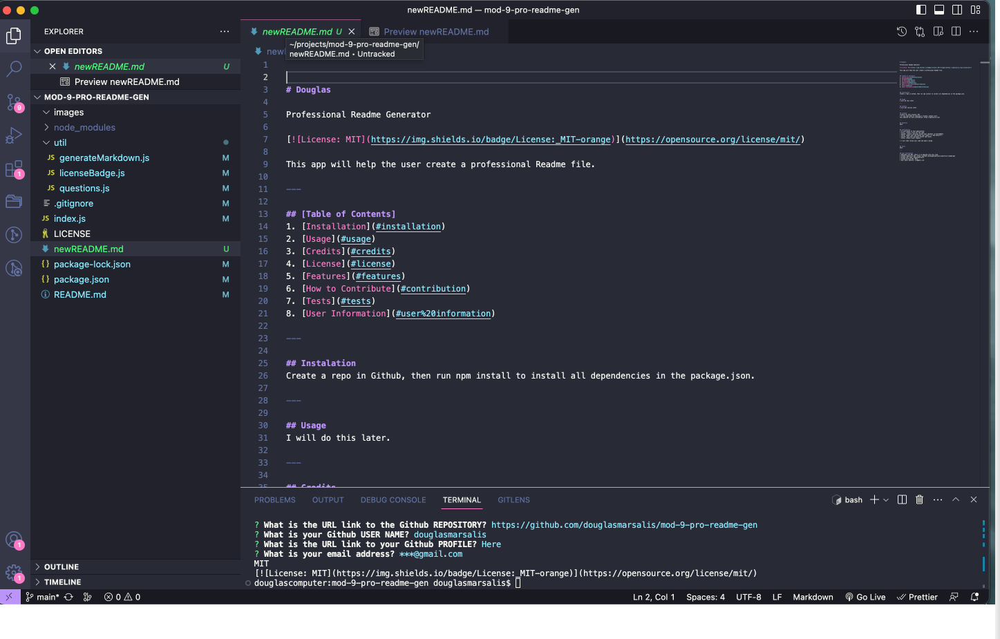
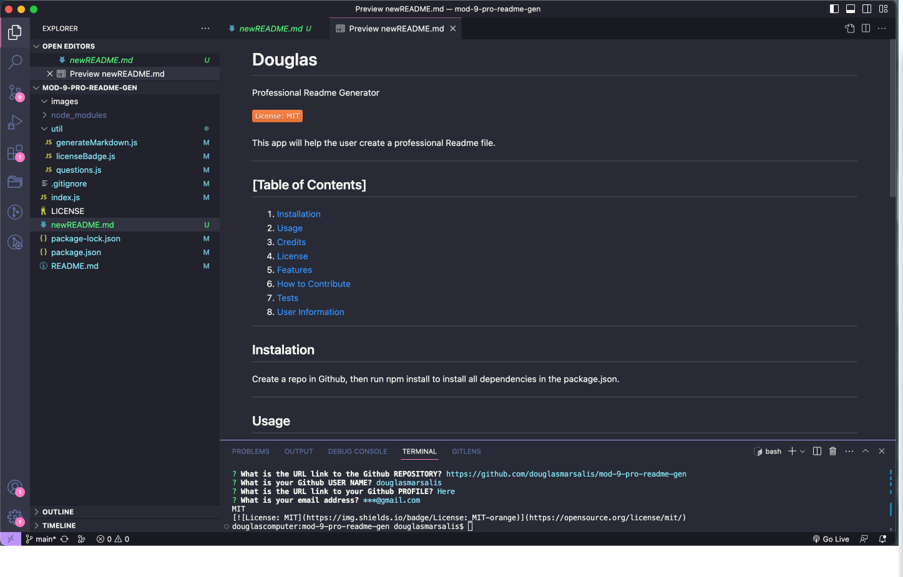

# mod-9-pro-readme-gen

## 

## Description
* For this project, I will create an application that will enable a user to create a Professional README.md file.
* This application will feature Node.js and use npm dependencies such as inquirer.
* I will make sure that my code follows industry standards and is sourced correctly.
* By building this application, it has helped me to learn information on Node.js, npm, badge maker and other info.

## User Story
AS A developer, I WANT a README generator SO THAT I can quickly create a professional README for a new project.

## Acceptance Criteria
GIVEN a command-line application that accepts user input
WHEN I am prompted for information about my application repository
THEN a high-quality, professional README.md is generated with the title of my project and sections entitled Description, Table of Contents, Installation, Usage, License, Contributing, Tests, and Questions
WHEN I enter my project title
THEN this is displayed as the title of the README
WHEN I enter a description, installation instructions, usage information, contribution guidelines, and test instructions
THEN this information is added to the sections of the README entitled Description, Installation, Usage, Contributing, and Tests
WHEN I choose a license for my application from a list of options
THEN a badge for that license is added near the top of the README and a notice is added to the section of the README entitled License that explains which license the application is covered under
WHEN I enter my GitHub username
THEN this is added to the section of the README entitled Questions, with a link to my GitHub profile
WHEN I enter my email address
THEN this is added to the section of the README entitled Questions, with instructions on how to reach me with additional questions
WHEN I click on the links in the Table of Contents
THEN I am taken to the corresponding section of the README

## Sources
* Code how to (RICE Univ lecture): https://zoom.us/rec/play/DcW33_xZBHhVzir1RBbUVJOzKv_TtCUzOn4XkJD9xNSuVchvV1FLl_pVhZFSzEQVqdDMKml_jJIkKsyW.bowSVMg4KMNf2_0Z
* Code how to: https://github.com/jfisher396/readme-generator 
* Code how to: https://www.youtube.com/watch?v=9YivEQFpmHQ
* Code how to: https://egghead.io/lessons/javascript-how-to-write-a-javascript-library-adding-badges-to-your-readme
* npm dependencies: https://www.npmjs.com/
* Badge design: https://shields.io/badges/static-badge
* Open source license: https://opensource.org/ 

## Link to Deployed Site

None this time.

## Link to Github Repository

https://github.com/douglasmarsalis/mod-9-pro-readme-gen 

## Screenshots and Video

[Professional Readme Generator.webm](https://github.com/douglasmarsalis/mod-9-pro-readme-gen/assets/112460009/32d3b4ee-d162-4615-8c00-1aeef929151d)

## License
MIT License 

Copyright (c) 2023 Douglas Eric Marsalis

Permission is hereby granted, free of charge, to any person obtaining a copy
of this software and associated documentation files (the "Software"), to deal
in the Software without restriction, including without limitation the rights
to use, copy, modify, merge, publish, distribute, sublicense, and/or sell
copies of the Software, and to permit persons to whom the Software is
furnished to do so, subject to the following conditions:

The above copyright notice and this permission notice shall be included in all
copies or substantial portions of the Software.

THE SOFTWARE IS PROVIDED "AS IS", WITHOUT WARRANTY OF ANY KIND, EXPRESS OR
IMPLIED, INCLUDING BUT NOT LIMITED TO THE WARRANTIES OF MERCHANTABILITY,
FITNESS FOR A PARTICULAR PURPOSE AND NONINFRINGEMENT. IN NO EVENT SHALL THE
AUTHORS OR COPYRIGHT HOLDERS BE LIABLE FOR ANY CLAIM, DAMAGES OR OTHER
LIABILITY, WHETHER IN AN ACTION OF CONTRACT, TORT OR OTHERWISE, ARISING FROM,
OUT OF OR IN CONNECTION WITH THE SOFTWARE OR THE USE OR OTHER DEALINGS IN THE
SOFTWARE.
